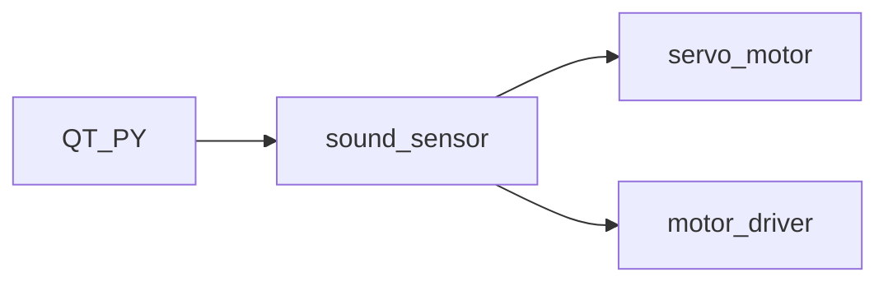

# ESE519-FinalProj    “Wrangler”

## Demonstration

The Completed Wrangler looks like: 

Gif in action:

---Joystick Mode:

Use the joystick located on the left hand side of the horse to control the direction of the Wrangler.

https://github.com/skyfall88888/ESE519-FinalProj/blob/main/Wrangler_joystick_mode.gif

---Sound Mode:

Make any sound would drive the Wrangler forward, at the same time, wave the whip and hit the horse once.

https://github.com/Thea-E/ESE519-FinalProj/blob/main/Wrangler_sound_mode.gif

## How we made it

System diagram:

Components list:

| Component Name| Quantity |
| ------------- | ------------- |
| car chassis | 1  |
| servo motor | 1  |
| DC motor  | 2  |
| motor driver | 1 |
| joystick | 1 |
| sound sensor  | 1  |
| distance/motion sensor  | 1|
| voltage switch  | 1|

### From Proposal to Demo
This is our proposed model, cute and interesting. We were thinking using a motion sensor APDS9960 to control the horse to move to different directions. 

First thing we did was nailed the QY PY 2040 board. We read through the datasheet and made our "budget" for the pins and memories. 

We started from making each small module work and then combined them altogether. They can be summarized as 

After we made all parts function together, we started mounting them on the chassis. We put the breadboard on the first layer of acylic board on the chassis, arrange the wires to made it look nicer, then we mounted a second layer of acrylic board to hold the "wrangler" and its whip.

When we tested it out in the assembled version, we found that the wrangler stands too high and the whole thing would loss balance when it run, so we added some weights in the bottom layer to make it run smoother.

Finally it look like this!

## Troubles we met
1. Problem 1: Servo motor

Problem: the starting, ending angle of servo motor are not precise. The rotation rate of servo motor is not stable.
Often times it just clogs.

Solution: implement an additional servo motor driver voltage level shifter breakout board that takes in a GPIO PWM and outputs a higher- voltage-protected PWM wave that feeds to the servo motor. With separate power supply and reworked PWM wave GPIO output, the behaviour is now stable.

 Problem 2: Sound sensor
 
Problem: sound sensor tends to behave unstably with different main.c settings(loop VS one go). And it tends to have limited accuracy distinguishing between short sharp sounds and long gentle sounds.

Solution: Reconfigured the structure of code. Changing looped sound.c to a one-go structure. Redesigned the way function gets called. Redesigned the way ADC reads in the analog input and the threshold values.

 Problem 3: joystick

Problem: the output range of joystick is quite random. Distinguishing left and right can be confusing. Because of the analog nature of the joystick, there is no actual solution. We redesigned the determining algorithm to better improve the accuracy.

 Problem 4: main.c
 
Problem: our initial plan was to pick up the following inputs in a sequencer: sound->apds->joystick. But when implementing this function, it gets stuck in one sensor, or, several inputs try to take over at the same time. It also happens when the main has passed the sound input part when the input sound was made. This led to an extremely unstable response from the system.

Meanwhile, ADPS motion detection is unstable, it almost can only detect the presence of our hands but not the motion/direction. We reference the python src code for adps motion detection, and programmed out c code in similar algorithm logic. However, check debug output below, when hands waving on top of the sensor, whatever gesture we made, the raw data is present but not in big difference, after calculation, the gesture is always treated as '0'(up).

Solution: We decided to change the setting to a new algorithm: use apds to control/switch between 2 modes: 1. sound mode, 2. joystick mode. Waving the hand at the apds will switch one mode to another.

## What did we learn

## About PIO 

## Our Team
