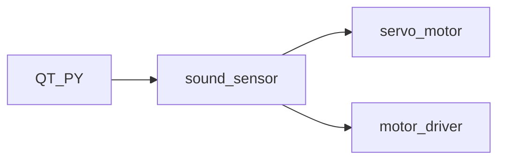
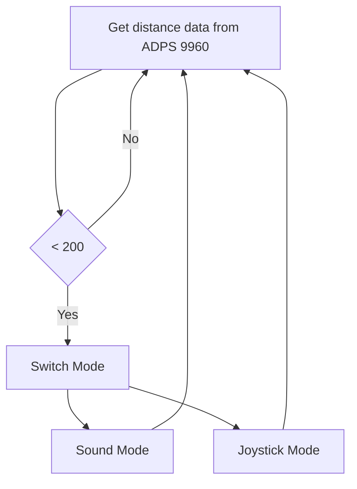

# ESE519-FinalProj    “Wrangler”

## Demonstration

The Completed Wrangler looks like: 

### Functionality Description:

Two parts of the wrangler can be controlled over various ways: the whip and the movement of the Wrangler. There are two modes designed to control the Wrangler: through sound or joystick. 

Sound mode: make a sound towards to sound sensor triggers the whip. The whip gently hits the horse once and the Wrangler moves forward.

Joystick mode: Using the joystick to control the Wrangler to move in 3 directions: forward, left or right. 

### Gif in action:

---Joystick Mode:

Use the joystick located on the left hand side of the horse to control the direction of the Wrangler.

https://github.com/skyfall88888/ESE519-FinalProj/blob/main/Wrangler_joystick_mode.gif

---Sound Mode:

Make any sound would drive the Wrangler forward, at the same time, wave the whip and hit the horse once.

https://github.com/Thea-E/ESE519-FinalProj/blob/main/Wrangler_sound_mode.gif

## How we made it

System diagram:

Components list:

| Component Name| Quantity |
| ------------- | ------------- |
| Car Chassis | 1  |
| Servo Motor | 1  |
| DC Motor  | 2  |
| Motor Driver | 1 |
| Joystick | 1 |
| Sound Sensor  | 1  |
| Distance/motion Sensor  | 1|
| Voltage Switch  | 1|

### Development
Attached below is the proposed idea of Wrangler(which is a bit different from the final deliverable). The proposed model is cute and interesting. We were thinking using a motion sensor APDS9960 to control the Wrangler to move in different directions. 

First thing we did was to plan the use of the pins of the QT PY 2040 board. We read through the datasheet and allocated the pins and memories for different uses. The pins are assigned as below:

 

We started from making each small module work and then combined them altogether. They can be summarized as 

After coding, configuring, testing all the broke-down functions mentioned, we mounted them onto the chassis. The breadboard was secured on the first layer of acylic board on the chassis, the wires were carefully arranged for clarity and ease of debugging. The second layer of acrylic board was used hold the "wrangler" toy for a better visual prospective.

  

Then we tried to test the functions in an integrated manner by redesigning the C file, Cmake files and code structures. After failing due to a few bugs, we managed to get functions working. However, there are still structural problems that we found out during the process. The wrangler was placed too high and when the motors drive the chassis to move, especially forward,  the Wrangler loss balance. Thus, we decided to implement some weights at the bottom layer to lower the center of gravity and adjusting the running interval of motor for a smoother movement. 

The final deliverable looks like this: !

   

## Troubles we met
**1. Problem 1: Servo motor**

**Problem:** the starting, ending angle of servo motor are not precise. The rotation rate of servo motor is not stable. It frequently clogs when not placed horizontally.

**Solution:** implement an additional servo motor driver voltage level shifter breakout board that takes in a GPIO PWM and outputs a higher- voltage-protected PWM wave that feeds to the servo motor. With separate power supply and reworked PWM wave GPIO output, the behaviour is now stable. It solves the angle precision problem and the clogging problem at the same time with the additional breakout board.

**Problem 2: Sound sensor**
 
**Problem:** sound sensor tends to behave unstably with different main.c settings(loop VS one go). And it tends to have limited accuracy distinguishing between short sharp sounds and long gentle sounds.

**Solution:** Reconfigured the structure of code. Changing looped sound.c to a one-go structure. Redesigned the way function gets called. Redesigned the way ADC reads in the analog input and the threshold values.

**Problem 3: joystick**

**Problem:** the analog output range of joystick is quite random and with some delay. Such behavior is not observable through oscillioscope. The output value of a left push and a right push are distinct for every trail and dependent on previous trail if two pushes were conducted in a short period of time.  Because we are using ADC function of QT PY to read in analog ADC count, and the analog output nature of the joystick, the only way to improve the accuracy is algirithmic.. 

**Solution:** We redesigned the determining algorithm to better improve the accuracy and implemented updated timing contraints to the reading function to minimize the effect between each push.

**Problem 4: main logic**
 
**Problem:** our initial plan was to pick up the following inputs in a sequencer: sound->apds->joystick. But when implementing this function, we were struggling in deciding if we should let the Wrangler wait for one sensor to get input then move on, or wait a certain interval of time for input then move on. In either case, a lagging situation is definitely going to happen if user inputs through one sensor when system is currently waiting for another sensor to read inputs. It can also happen that several inputs are made at the same time but only one of them should actually "instruct" the wrangler to behave. This led to an extremely unstable response from the system.

**Solution:** We decided to change the setting to a new algorithm: use APDS sensor(proxomity) to control/switch between 2 modes: 1. sound mode, 2. joystick mode. Waving the hand at the apds will switch one mode to another.

**Problem 5: APDS Motion Detection**

We attempted ADPS motion detection extensively through adopting the detection algorithm developed in the source code provided(in Python). The behavior, however, is extremely unstable. It certainly is able to detect the presence of our hands but not necessarily the motion/direction. We also adopted a complicated determining algorithm to find the actual motion. But the first step-reading in values, is rather unstable. An example of such error is illustrated below:  when hands waving on top of the sensor, whatever gesture we made, the raw data is present but not in big difference, after calculation, the gesture is most of the time treated as '0'(up).

## What did we learn

1. Method of dealing with multi-file C project based on embedded systems. 

2. Use of Cmake tool to configure and compile files involving multiple libraries.

3. Real-world embedded system debugging including both hardware and software sections.

4. Implement hardware-based circuits with software control.

## About PIO 
PIO was used for the LED(mode indicator) and to drive the APDS9960 distance/motion sensor.

The general steps we programmed the PIO state machine are:

1. Determine which PIO instance to use(out of 2) PIO pio = pio0; PIO pio = pio1; 

2. Assign instructions into instruction memory with sufficient space uint offset = pio_add_program(pio, &program_name_here) 

3. Find an available state machine uint sm = pio_claim_unused_sm(pio, true); some_kind_of_program_init(pio, sm, offset, PICO_DEFAULT_LED_PIN); 
 
5. Up to this point, state machine is ready and running.

PIO's advantages:
1. With pio, we can effectively implement any protocol at our need for the I/O communication. It's far more powerful and convenient over bit-banging. If using bit-banging, it will continuously consumes the memory and kernel of the PC, while the computer has other tasks to do.  For slower protocols you might be able to use an IRQ to wake up the processor from what it was doing fast enough (though latency here is a concern) to send the next bit(s). But PC-class processors keep many hundreds of instructions in-flight on a single core at once, which has drawbacks when trying to switch rapidly between hard real time tasks. 

2. PIO has it's strict timestamps, each instruction takes exactly one cycle, so it make it easier for the timing when programming and gives more control to the programmer. 

3. PIO states machine runs independently from the main processor, it saves memory, efficiency and pins.

These features make PIO a unique asset for a microcontroller.

## Code for Wrangler

The code files for the Wrangler can be found at the following link:

https://github.com/skyfall88888/ESE519-FinalProj/blob/main/Wrangler.zip

## Our Team
Yu Feng   https://github.com/skyfall88888
Thea Yu   https://github.com/Thea-E
